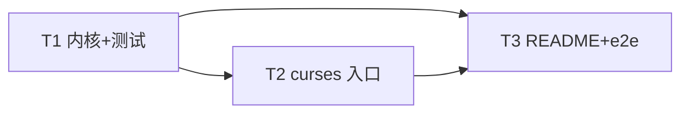

# 0001 · 命令行贪吃蛇游戏（Python 标准库，curses TUI）

<!-- 本文件由 spec 工具维护：frontmatter 为结构化源数据（含 tasks DAG），正文为组级 rust-RFC 9 段总览。 -->

## Summary

用纯 Python 标准库实现一个可在终端直接运行的贪吃蛇小游戏。入口 `snake.py` 运行 `python snake.py`
即开始：用 `curses` 渲染全屏网格，方向键与 WASD 双套按键控制蛇移动；蛇吃到食物变长并加分，撞墙或撞到
自身则游戏结束、显示最终得分。核心规则收敛在一个**与终端 I/O 完全解耦的纯逻辑内核** `snake_game.py`
里，使移动、转向、吃食物、碰撞、计分逻辑可被 `pytest` 确定性地覆盖（注入固定随机种子）。仓库附 README
说明如何运行与测试。全程零第三方依赖（`curses`/`random`/`collections` 皆标准库）。

## Motivation

issue #1 要求：「用纯 Python 标准库实现一个可在终端运行的贪吃蛇小游戏 `snake.py`」，四条硬性验收——
(1) 运行 `python snake.py` 即可开始，方向键/WASD 控制；(2) 吃到食物变长、加分，撞墙或撞自身结束并显示
得分；(3) 代码含最小单元测试（移动/碰撞/吃食物逻辑），`pytest` 可跑通；(4) 附 README 说明如何运行。
形式为命令行（cli），无需浏览器。

当前仓库是一个 OpenAgents 端到端演示仓（只有一个 README，无任何游戏代码），需要从零起草并实现。设计上
的关键张力在于要求 (1)(2) 是**终端交互行为**（需要真实 tty 的 `curses`，无头 CI 无法稳定驱动），而要求
(3) 是**可自动化验证的纯逻辑**。若把游戏规则和 `curses` 渲染写在同一处，规则将无法在没有终端的环境里被
`pytest` 覆盖——这正是本设计要规避的。因此动机不仅是「实现能玩的贪吃蛇」，更是**把可测的规则内核与不可
无头测的 I/O 外壳切开**，让验收项 (3) 有干净的落点，同时让 (1)(2) 的交互层保持极薄。

## Guide-level explanation

玩家在终端运行：

```bash
python snake.py
```

屏幕出现一个带边框的网格，蛇（初始几节）从中间出发，网格内某处有一个食物。顶部或标题栏显示当前得分。

- **控制**：方向键 `↑ ↓ ← →` 或 `W A S D`（大小写均可）转向；`q` 退出。
- **规则**：蛇按当前方向定时前进一格。吃到食物 → 蛇尾不缩、身体变长一节、得分 +1，并在空格随机刷新一个
  新食物。若蛇头越过边框（撞墙）或撞到自己的身体 → 游戏结束。
- **结束**：清屏并显示 `Game Over` 与最终得分，提示按键退出。
- **反向保护**：当蛇正在向右时按「左」（正相反方向）会被忽略，避免蛇瞬间掉头撞进自己。

对开发者而言，游戏被拆成两层：

```python
# 纯逻辑内核，可脱离终端直接实例化与推进（用于测试与入口共用）
from snake_game import SnakeGame, Direction

game = SnakeGame(width=20, height=10, seed=42)   # 固定 seed → 食物位置确定、可断言
game.step(Direction.RIGHT)                        # 推进一帧
game.snake        # deque[(x, y)]，头在一端
game.score        # int
game.game_over    # bool
```

`snake.py` 只做三件事：读键→翻译成 `Direction`、按节拍调 `game.step(...)`、把 `game` 的状态画到屏幕。
它**不**自己判断碰撞或计分——那些只在 `snake_game.py` 里存在一份。

## Reference-level explanation

### 架构与模块契约

两层、单向依赖 `snake.py → snake_game.py`：

- **`snake_game.py`（纯内核，无 I/O，不 import curses）**
  - `class Direction(Enum)`：`UP/DOWN/LEFT/RIGHT`，各带 `(dx, dy)` 向量；`opposite` 供反向阻挡。
  - `class SnakeGame`：
    - `__init__(width, height, seed=None)`：建网格、初始蛇（居中横向数节）、`random.Random(seed)`
      注入随机源，随机放置首个食物；`score=0`、`game_over=False`。
    - `step(direction=None)`：核心状态机——① 若传入方向且非当前方向的反向，则更新方向；② 计算新头
      坐标；③ 撞墙（越界）或撞自身 → `game_over=True` 并返回；④ 新头入队；⑤ 若新头==食物：`score+=1`、
      不弹尾（变长）、`_spawn_food()`；否则弹尾（等长前进）。
    - `_spawn_food()`：在所有「非蛇身」空格里用注入的 `Random` 均匀选一格；无空格（通关）时置结束。
    - 只读属性/字段：`snake`（`deque`）、`food`、`score`、`game_over`、`direction`。
  - **不变量**：内核任何路径都不触碰 stdin/stdout/curses；随机性只来自注入的 `Random`，故给定 `seed`
    整局可复现（测试基石）。
- **`snake.py`（curses 入口，极薄 I/O 外壳）**
  - `main(stdscr)`：`curses` 初始化（`nodelay` 非阻塞、`keypad(True)` 收方向键、隐藏光标），主循环按
    固定 tick 调 `game.step()`，`_read_direction(stdscr)` 把 `KEY_UP/DOWN/LEFT/RIGHT` 与 `w/a/s/d`
    映射为 `Direction`（`q` → 退出），`_render(stdscr, game)` 画边框/蛇/食物/得分；`game.game_over`
    后画结束画面显示 `game.score`。
  - `if __name__ == "__main__": curses.wrapper(main)`——`wrapper` 保证异常时恢复终端。非 tty 环境下
    `curses` 初始化失败要捕获并打印友好提示（而非裸回溯）。

### DAG + 文件分配

| Task | 标题 | files（单一 writer） | depends-on |
|------|------|----------------------|------------|
| T1 | 纯游戏内核 + pytest 单测 | `snake_game.py`, `tests/test_snake_game.py` | — |
| T2 | curses TUI 入口 | `snake.py` | T1 |
| T3 | README + 离线 e2e 脚本 | `README.md`, `scripts/e2e-spec-0001-snake-cli-game.sh` | T1, T2 |



各 Task `files` 互斥（单一 writer 所有权）。T1 是根，交付后 T2/T3 可并行推进。

### e2e 脚本

`scripts/e2e-spec-0001-snake-cli-game.sh`（详见 frontmatter `e2e` 块）：`ruff check` + `pytest
tests/test_snake_game.py` + 对 `snake.py` 的 grep 锚点（`curses.wrapper`、方向键/WASD 映射、`__main__`
入口）。退出码 0 视为离线段通过，被 PR e2e signpost 采集。`curses` 交互层需真实 tty，改用 README 记录的
人工终端验证清单补足（取证纪律：需 tty 的 UI 不拿无头测试冒充）。

## Drawbacks

- **`curses` 平台性**：`curses` 在类 Unix 终端可用，原生 Windows 无 `curses`（需 WSL 或 `windows-curses`
  第三方包）——但 issue 要求「纯标准库 + 终端运行」，类 Unix 是合理默认，故接受此局限。
- **交互层无法无头自动化**：`curses` 主循环需真实 tty，CI 里只能靠纯内核测试 + grep 锚点 + 人工清单覆盖，
  入口的键位/渲染没有端到端自动断言，存在人工验证成本。
- **两文件而非单文件**：为可测性把逻辑与 I/O 拆成两个模块，比「全塞进 snake.py」多一个文件；但换来的是
  验收项 (3) 有干净落点，值得。

## Rationale and alternatives

**本设计**：纯内核 `snake_game.py` + 薄 `curses` 入口 `snake.py`，随机源可注入。核心理由是让验收项 (3)
（pytest 覆盖移动/碰撞/吃食物）落在一个**不依赖终端、可用固定 seed 复现**的内核上，同时保持 `snake.py`
可直接 `python snake.py` 运行满足 (1)。

**备选 1：单文件 `snake.py`，逻辑与 `curses` 混写。** 更少文件、最贴「一个 snake.py」的字面要求。但游戏
规则与 `curses` 渲染耦合后，`pytest` 要么得起真实 tty（CI 不可行），要么得 monkeypatch 大量 `curses`
调用才能触达纯逻辑，测试脆弱且失真。与验收项 (3)「pytest 可跑通」冲突，故不采。

**备选 2：用第三方库（`blessed` / `pygame`）做渲染。** 开发体验更好、跨平台更稳。但 issue 明确「纯 Python
标准库」，引入依赖直接违约，排除。

**备选 3：随机食物用全局 `random` 而非注入 `Random(seed)`。** 代码略短。但那样食物位置不可复现，吃食物/
变长/计分的断言只能测「长度变化」不能测「确定坐标」，削弱测试强度。注入随机源成本极小、收益明确，故采注入。

## Prior art

贪吃蛇是教学级经典项目，Python 生态里「`curses` + 纯逻辑内核分层」是常见范式（Python 官方文档的 curses
HOWTO 即示范用 `curses.wrapper` 包裹主函数以保证终端恢复）。本设计不引用任何外部 spec，规则与分层均为
就地自包含描述。「把可测纯逻辑与不可无头测的 I/O 切开」也呼应通用测试金字塔实践。

## Unresolved questions

- 网格尺寸/游戏速度（tick 间隔）取固定默认值即可，是否需要命令行参数化留待需求确认——当前按**固定默认、
  不加 CLI 参数**处理，以最小实现满足 issue。
- 是否需要「食物填满即通关」的胜利画面：内核 `_spawn_food` 在无空格时置结束，入口是否单独区分「胜利」与
  「失败」文案，留作可选，不作为验收项。

## Future possibilities

- 记分持久化（最高分写入本地文件）、多难度（可调速度/网格）、穿墙模式等玩法开关。
- 命令行参数（`--width/--height/--speed/--seed`）暴露内核已有的可配置项。
- 用 `windows-curses` 或改用 `blessed` 抽象渲染层以支持原生 Windows（需放宽「纯标准库」约束时）。

