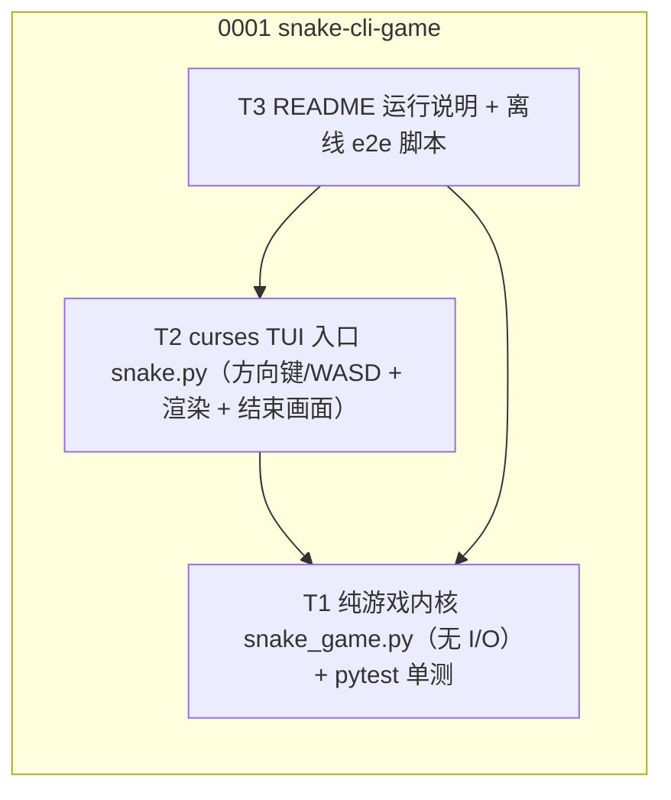
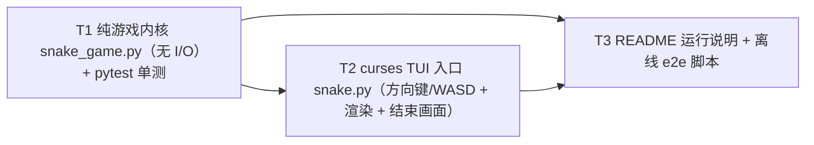
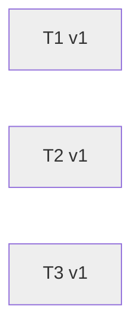

# Spec 总览（OVERVIEW）

> 本文件由 `spec render` 自动生成，请勿手工编辑（Spec-0014/T3）。

## TL;DR（人话速览）

### 0001 命令行贪吃蛇游戏（Python 标准库，curses TUI）
用纯 Python 标准库实现可在终端运行的贪吃蛇：snake.py 为 curses 入口（方向键/WASD 控制、吃食物变长加分、撞墙/撞自身结束并显示得分），纯游戏内核 snake_game.py 与 I/O 解耦以便 pytest 覆盖移动/碰撞/吃食物逻辑，附 README 说明运行方式。
- e2e 意图：证明「python snake.py 贪吃蛇」满足 issue
  - 测法：形态：纯 CLI/TUI 贪吃蛇（form=cli），交互层是 curses 全屏 TUI、无浏览器可导航前端， 且 curses 需真实 tty 无法在 CI 无头稳定驱动。按取证纪律分两类证据： 1. 纯内核逻辑（UI 不可见但是产品行为）→ 相称自动化测试：tests/test_snake_game.py 注入固定    seed，断言移动/转向/反向阻挡/吃食物变长加分/撞墙/撞自身/食物避开蛇身，pytest 全绿。 2. curses 入口（需 tty，不在 CI 跑真 app）→ 静态 grep 锚点 + 人工终端验证清单：    grep 断言 snake.py 含 curses.wrapper、方向键(KEY_UP/DOWN/LEFT/RIGHT)+WASD 键映射、    __main__ 入口、且方向决策委托 snake_game（不在入口重写规则）；README 记录人工验证步骤    （python snake.py 实机跑一局，验方向键/WASD 控向、吃食物加分变长、撞墙/撞自身显示得分）。 脚本：scripts/e2e-spec-0001-snake-cli-game.sh（ruff check + pytest tests/test_snake_game.py + snake.py grep 锚点），退出码 0 视为离线段通过，被 PR e2e signpost 采集。 

## 全局看板

| 组 | 任务 | 标题 | 状态 | 依赖 | 涉及文件 |
|----|----|----|----|----|----|
| 0001 | 0001/T1 | 纯游戏内核 snake_game.py（无 I/O）+ pytest 单测 | pending | — | snake_game.py tests/test_snake_game.py |
| 0001 | 0001/T2 | curses TUI 入口 snake.py（方向键/WASD + 渲染 + 结束画面） | pending | T1 | snake.py |
| 0001 | 0001/T3 | README 运行说明 + 离线 e2e 脚本 | pending | T1, T2 | README.md scripts/e2e-spec-0001-snake-cli-game.sh |

## 跨 feature 关系图

## 文件冲突报告

无跨组文件冲突。

## 各 feature 详情

### 0001 命令行贪吃蛇游戏（Python 标准库，curses TUI）（issue #1）

演化图：

